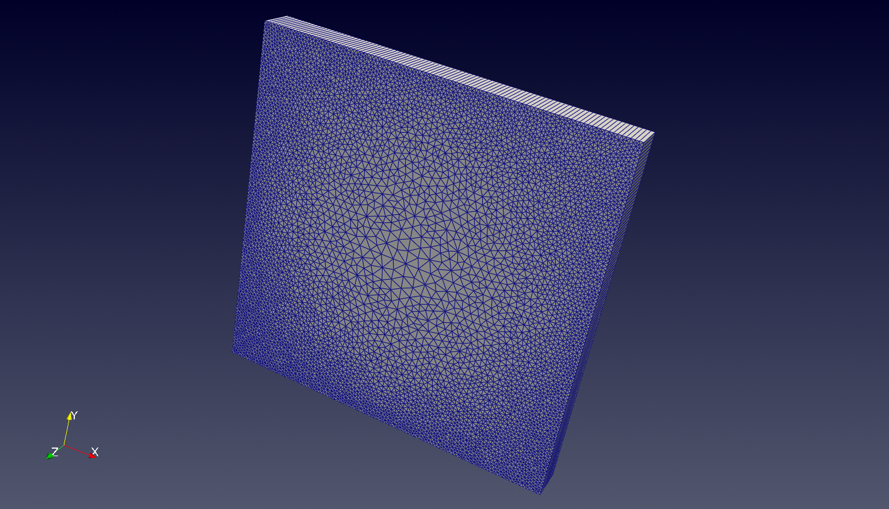
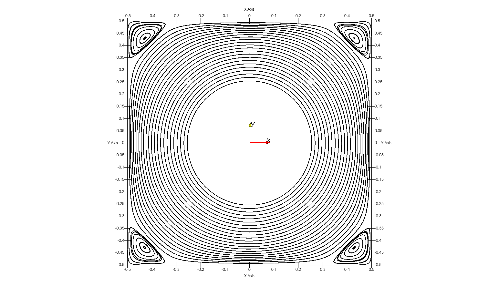

# OpenFOAM-tutorials
OpenFOAM tutorials for educational purposes using `OpenFOAM v2406`. The following cases are included:

## Airfoil 

- Steady-state, incompressible, 2D flow past a NACA 0015 airfoil
- C-grid is created using a python script, obtained by [curiosityFluids](https://curiosityfluids.com/)
- The airfoil shape is downloaded from the [airfoiltools](http://airfoiltools.com/) online database.
- Turbulence model: RANS Spalart-Allmaras one equation model
- Solver: simpleFoam
- Angles of Attack: 0-15 dgr

## Unstructured lid-driven cavity

- Unsteady, lid-driven cavity case.
- Mesh created using the `gmsh` tool.
- Unstructured mesh, clustered near the cavity edges.
- Solver: icoFoam

## Cavity with an inner rotating wall

- Solve a square cavity with an inner rotating wall.
- The outer walls are stationary.
- Mesh created using the `gmsh` tool.
- Inner wall angular velocity $\omega=2$ rad/s.
- Solver: icoFoam

## Continuous stirred-tank reactor

- A continuous stirred tank reactor, with a four-bladed impeller located in the middle of the reactor to provide the mixing force.
- Simplified case taken from the [Two-phase stirred tank reactor simulation](https://www.cemf.ir/simulating-two-phase-stirred-tank-reactor-using-openfoam/).
- For simplisity, we assume that only compressible air in room temperature exists in the tank.
- The impeller rotates at $\omega=120$ RPM.
- The rotation is modelled using the MRF technique.
- The rotating shaft has been omited.
- Assumed laminar flow.
- Solver: rhoSimpleFoam

